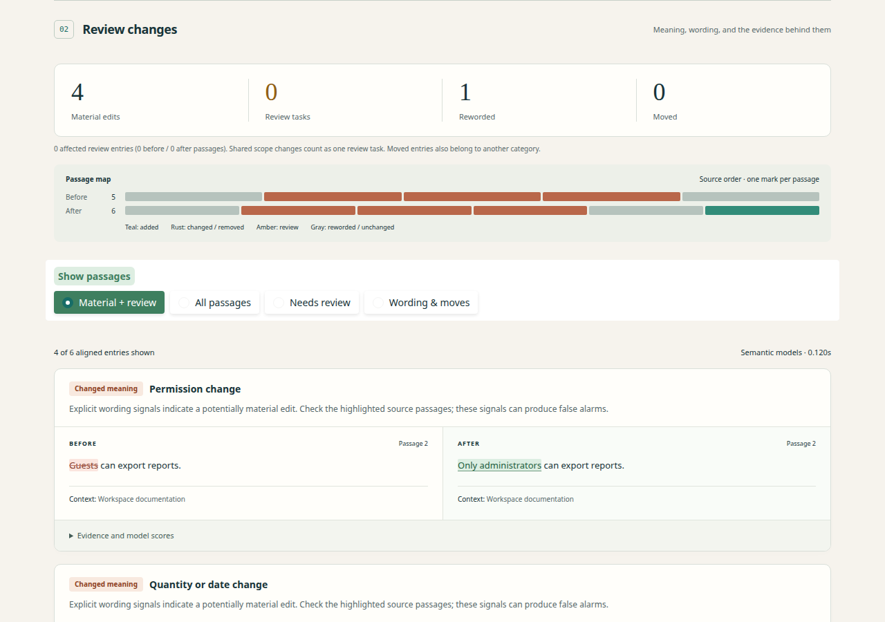
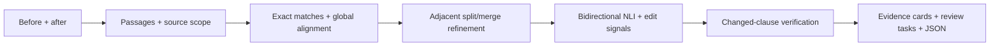

# Semantic Change Radar

**Review meaning changes across two document versions, with the source evidence beside every finding.**

[](https://github.com/Habetyan/semantic-change-radar/actions/workflows/checks.yml)

[Explore recorded examples](https://huggingface.co/spaces/artush-habetyan/semantic-change-radar-demo)
· [Watch the walkthrough](docs/images/walkthrough.mp4)
· [Evaluation and failures](docs/resume-results.md)
· [Review the annotations](docs/review/README.md)

Compare requirements, limits, permissions, and exceptions. The app aligns passages,
handles adjacent paragraph splits/merges, and separates likely paraphrases from
material edits and unresolved cases. Expand any card to inspect original text,
heading/list context, changed clauses, and model scores. Export the full report as JSON.



The **Gradio app performs real inference on CPU** using two small pinned ONNX models.
It needs no API key or GPU. The linked **static showcase displays recorded outputs**;
run Gradio locally to compare your own documents.

## Run locally

Python **3.12** is tested. From the repository directory:

```bash
python -m venv .venv
source .venv/bin/activate
pip install -r requirements.txt -c requirements.lock
python app.py
```

Open **http://127.0.0.1:7860**. On Windows, activate with `.venv\Scripts\activate`.
First semantic use downloads about **106 MB of weights** plus tokenizers into the
Hugging Face cache. Later calls reuse them. After caching, `HF_HUB_OFFLINE=1 python app.py`
prohibits Hub requests. The lexical baseline needs no model download.

Documents are processed on the machine running Gradio, with no inference API.
Session reports are held in memory; temporary downloads expire. There is no app database
or stored document history. On a hosted app, processing happens on its server.

Eight examples include five illustrative scenarios and three complete extracted
historical pages from HTTPX, pip, and MkDocs, with source links and license attribution.
Try HTTPX for a recovered split and a changed argument list. Inspect MkDocs for a
remaining incorrect correspondence. These pages are historical, not current guidance.

## Pipeline



- **Alignment:** MiniLM embeddings and lexical similarity establish candidate
  correspondence. Heading/list context adjusts matching. Unmatched passages remain
  explicit additions/removals.
- **Grouping:** bounded adjacent 1:2 / 2:1 refinement requires support from both
  fragments and a combined-score improvement. Larger rewrites remain unsupported.
- **Decisions:** bidirectional NLI, numeric/condition/actor guards, and localized
  detail checks distinguish likely equivalence, modification, and uncertainty.
  Localized excerpts now retain exact source punctuation.
- **Review:** repeated uncertainty inherited from the same physical heading/list
  owner forms one expandable task. Every source passage and raw uncertain decision
  remains in the report. The passage map shows source order and status.

| Component | Pinned model | Deployment |
|---|---|---|
| Embeddings | [all-MiniLM-L6-v2](https://huggingface.co/sentence-transformers/all-MiniLM-L6-v2) | Quantized ONNX, CPU, batches of 8 |
| NLI | [nli-MiniLM2-L6-H768](https://huggingface.co/cross-encoder/nli-MiniLM2-L6-H768) | Quantized ONNX, CPU, one pair per call |

Exact revisions and artifact hashes appear in code and evaluation outputs. Individual
NLI calls address a reproduced sensitivity to unrelated batch neighbors. The precise
cause was not isolated. No training or fine-tuning was performed.

## Measured results and limits

The latest blind diagnostic uses **six complete revision pairs from three previously
unseen repositories**, with 19 changed paired groups, including 11 material changes.
Labels were independently AI-reviewed before inference and **still need human validation**.

| Latest blind set | Lexical baseline | Archived v2 | Current verified |
|---|---:|---:|---:|
| Changed-correspondence F1 | .923 | .947 | .947 |
| All-event material F1 | .918 | .936 | .936 |
| Exactly aligned material edits accepted as equivalent | 1 | 1 | 1 |
| Raw uncertain entries | 0 | 9 | 9 |

Additions dominate all-event material F1. The current engine correctly classifies
**5 of 11 paired material edits**; other edits require review, are misaligned, or
are missed. This release does not claim an accuracy improvement over v2 on that set.

On the earlier development pages, shared scope grouping reduces the UI queue from
40 separate review entries to **20 review tasks**, while raw uncertain entries increase
to 45. Three false material child alerts become reviews, but three true material
classifications also become reviews. This is a workload and decision-policy tradeoff.

A separate local Qwen 7B experiment on 35 known development pairs improved a simulated
fallback's material F1 from .611 to .650. However, 13/35 responses failed exact-source
quote validation, and explanation auditing found unsupported claims. It remains an
experiment; the app still uses MiniLM. A DeBERTa NLI candidate was also tested and rejected.

See [the complete current report](docs/resume-results.md),
[earlier structure experiments](docs/improvements.md), and
[original real-document diagnostic](docs/real-evaluation.md). The original engine
archives, frozen inputs, labels, predictions, failure denominators, and source hashes
are retained. No broad accuracy or production-readiness claim is made.

Other limits:

- English text/Markdown, **30,000 characters and 80 passages per version**.
- Embedding inputs must fit 256 tokens; NLI pairs must fit 512 including special tokens.
  Oversized body input errors; optional oversized context becomes review and group
  candidates may be skipped. Nothing is silently truncated.
- Context elsewhere in a document can change identical text without being recognized.
  Heading changes can also cause false alerts. Uncertainty is not proof of equivalence.
- No PDF/OCR, arbitrary many-to-many grouping, multilingual or code understanding.
- Model scores are not calibrated confidence; rule guards also create false positives.

## CLI and reproducibility

```bash
python -m radar.cli before.md after.md --output comparison.json
python -m radar.cli before.md after.md --backend lexical
python -m radar.cli before.md after.md --profile baseline
```

The default `verified` profile matches Gradio. Cumulative `baseline`, `context`, and
`groups` profiles allow stage comparisons. Schema 2 uses canonical `old_indices` /
`new_indices` arrays and `old_parts` / `new_parts`; empty arrays denote absent sides.
Legacy scalar indices are only first-member anchors. All IDs are zero-based passages.

```bash
pip install -r requirements-dev.txt -c requirements.lock
pytest -q
RUN_MODEL_TESTS=1 pytest tests/test_models.py -q
ruff check .
ruff format --check .

HF_HUB_OFFLINE=1 python -m evaluation.real_evaluate \
  --manifest evaluation/blind-v3/manifest.json --backend semantic \
  --profile verified --output artifacts/local/blind-verified
```

Default tests do not download models. CI also runs real CPU model checks. See
[evaluation/README.md](evaluation/README.md) for metric definitions and protocols.
Once inspected, a held-out set is no longer unseen data for later tuning.

With Gradio running, repeat browser checks using an installed browser:

```bash
python scripts/browser_smoke.py --chrome /usr/bin/google-chrome
python scripts/browser_groups.py --chrome /usr/bin/google-chrome
```

## Human review and interview notes

The [offline annotation form](docs/review/README.md) hides proposed classifications,
shows full source context, saves drafts locally, and exports judgments for later
adjudication. It does not silently overwrite frozen labels or mark data validated.

[Interview notes](docs/INTERVIEW.md) explain the decisions, unsuccessful experiments,
and defensible resume wording. [HANDOFF.md](docs/HANDOFF.md) records current status.

## Hosting

The root README metadata and `app.py` support a Gradio Space. Upload the runtime
files and retain their license notices; exclude virtual environments, caches, private
inputs, and review submissions. The [static companion](showcase/README.md) is built
from recorded results with `HF_HUB_OFFLINE=1 python scripts/build_showcase.py`.

As checked on 2026-09-24, creating ordinary CPU Gradio/Docker Spaces requires a
paid HF plan, although CPU Basic has no hourly hardware charge. Static Spaces are
free. The current public showcase uses static hosting and clearly labels its outputs
as recorded. [Hugging Face hosting documentation](https://huggingface.co/docs/hub/spaces-overview).

Source code is MIT licensed. Upstream documentation and pretrained models retain
their own licenses; see [THIRD_PARTY_NOTICES.md](THIRD_PARTY_NOTICES.md).
